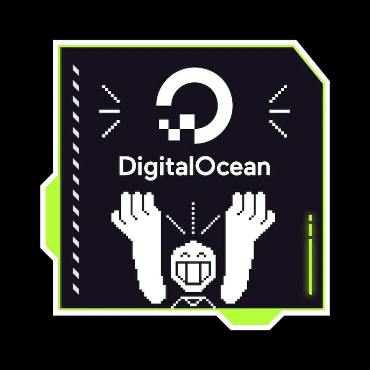

## Hi there 👋

 
  Visitor count 
  

<!-- a ✨ _special_ ✨ repository because its `README.md` (this file) appears on your GitHub profile.

Here are some ideas to get you started: -->

- 🔭 I’m currently working on MS Azure Services
- 🌱 I’m currently learning Cloud Computing
- 👯 I’m looking to collaborate on Software Development
- 🤔 I’m looking for help with DevOps Tools
- 💬 Ask me about Cloud Computing
- 📫 How to reach me: [LinkedIn](https://www.linkedin.com/in/arslaan-thanedar-59553921b/)
<!-- - 😄 Pronouns: ... -->
<!-- - ⚡ Fun fact:  -->

#
# 🚀 Hacktober init...
#

## Badges

Add badges from somewhere like: [shields.io](https://shields.io/)

